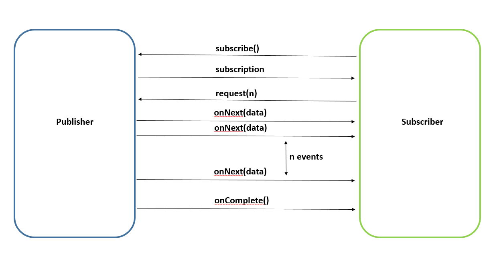

# webflux 5:

### server: 8080

### client: 8081

step 1: build and run 2 applications

step 2: send request by postman

    GET http://localhost:8081/          (blocking)

    GET http://localhost:8081/1         (non-blocking)

    POST http://localhost:8081/
    {
        "id": 1,
        "name": "cat"
    }
    PUT http://localhost:8081/{id}

I added security in server -> so *_ `POST` http://localhost:8081/ _* is not available


auto add header at here

    .defaultHeader("requestId", String.valueOf(UUID.randomUUID()))




follow direct if we listen from another service:

https://codersee.com/how-to-follow-redirects-3xx-with-spring-webclient/


```example
    @Bean
    fun webClientOne(httpClientOne: HttpClient): WebClient =
        WebClient.builder()
            .clientConnector(ReactorClientHttpConnector(httpClientOne))
            .baseUrl(BASE_URL)
            .build()

    @Bean
    fun webClientTwo(httpClientTwo: HttpClient): WebClient =
        WebClient.builder()
            .clientConnector(ReactorClientHttpConnector(httpClientTwo))
            .baseUrl(BASE_URL)
            .build()

    @Bean
    fun webClientThree(httpClientThree: HttpClient): WebClient =
        WebClient.builder()
            .clientConnector(ReactorClientHttpConnector(httpClientThree))
            .baseUrl(BASE_URL)
            .build()

    @Bean
    fun webClientFour(httpClientFour: HttpClient): WebClient =
        WebClient.builder()
            .clientConnector(ReactorClientHttpConnector(httpClientFour))
            .baseUrl(BASE_URL)
            .build()

    @Bean
    fun webClientFive(httpClientFive: HttpClient): WebClient =
        WebClient.builder()
            .clientConnector(ReactorClientHttpConnector(httpClientFive))
            .baseUrl(BASE_URL)
            .build()
@Bean
    fun httpClientOne(): HttpClient =
        HttpClient.create()

    // Removes sensitive headers
    @Bean
    fun httpClientTwo(): HttpClient =
        HttpClient.create()
            .followRedirect(true)

    // Print request info and add a new header
    @Bean
    fun httpClientThree(): HttpClient =
        HttpClient.create()
            .followRedirect(true) { redirectRequest ->
                println("URI: ${redirectRequest.uri()}")
                println("Is follow redirect: ${redirectRequest.isFollowRedirect}")
                println("Redirected from: ${redirectRequest.redirectedFrom().firstOrNull()}")
                println("Resource URL: ${redirectRequest.resourceUrl()}")
                println("Request headers: ${redirectRequest.requestHeaders()}")
                redirectRequest.addHeader("another-header", "another-value")
            }

    // Redirect only when a given conditions are met
    @Bean
    fun httpClientFour(): HttpClient =
        HttpClient.create()
            .followRedirect { clientRequest, clientResponse ->
                clientRequest.requestHeaders().contains("custom-header")
                    && clientResponse.status().code() == 302
            }

    // Re-add all headers. Use with caution!
    @Bean
    fun httpClientFive(): HttpClient =
        HttpClient.create()
            .followRedirect(true) { headers, request ->
                request.headers(headers)
            }
}
```